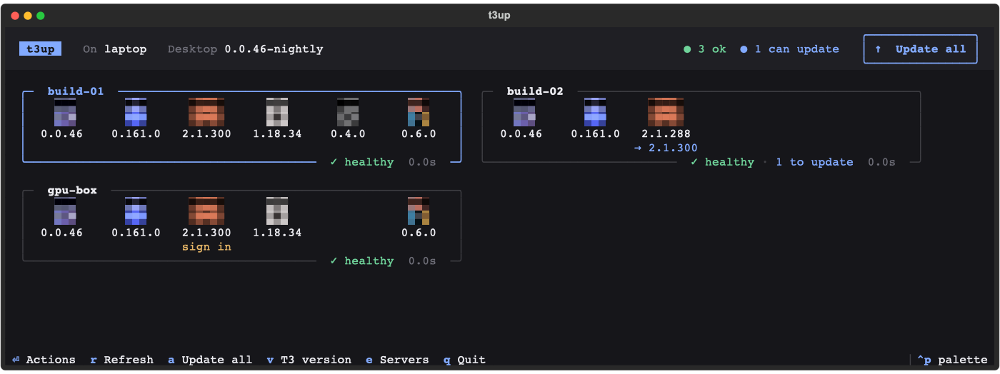
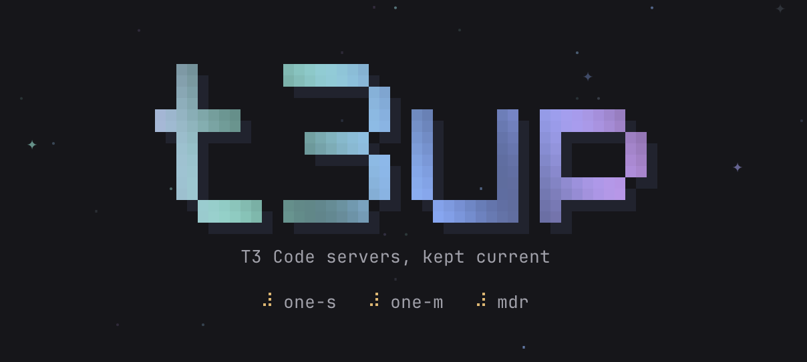

<p align="center"></p>

<h1 align="center">t3up</h1>

<p align="center">
A full-screen terminal dashboard for checking and updating your <a href="https://github.com/pingdotgg/t3code">T3 Code</a> servers over SSH.
</p>

<p align="center">
<a href="https://github.com/hkarlsen06/t3up/actions/workflows/test.yml"></a>
<a href="LICENSE"></a>
</p>



<p align="center"></p>

t3up shows every server you run T3 Code on, with the version of T3 and each provider CLI it drives
(Codex, Claude Code, OpenCode, Grok, Pi), whether each one is signed in, and whether a newer release is out.
You can update one server or all of them without leaving the terminal.

- **Check is read-only.** The dashboard checks every server on launch, and checking never changes anything.
- **Safe rollouts.** Updating several servers updates the first one alone first; the rest follow only if it
  comes back healthy. If T3 fails its health check after an update, t3up puts the previous version back.
- **Knows when a server is busy.** It counts the agents running under T3 and asks before an update would
  restart T3 over them.
- **What's new.** Press <kbd>c</kbd> to read the release notes of every update waiting on a server.
- **Updates tools the way they were installed.** A provider is updated with its own updater if it installed itself,
  otherwise with whichever of npm, pnpm, bun or Homebrew owns it. If t3up can't tell, it fails and says so instead of guessing.
- **Sign-in and pairing, in the dashboard.** When a tool on a server is signed out, t3up runs its login there
  and shows just what you need: the link (open it, or copy it), Codex's one-time code, or a box to paste
  Claude's code into. **Create pairing link** draws a scannable QR code with the link and token to copy, and
  how long it's valid. Anything unexpected still has **t: open in terminal**.
- **No agent on the server.** It runs a POSIX `sh` script over plain SSH. Nothing to install remotely.
- **Scriptable.** `--check` and `--update` give plain output and an exit code, for cron or CI.
- **Desktop app (macOS).** When your T3 Code desktop app is older than your servers, t3up can update it as well.
- **Alive.** A pixel-art intro rolls in while the first check runs, versions decode in as servers report,
  light runs around the border of a server that's busy, and finished cards glow green or red.
  Set `T3UP_NO_MOTION=1` for a still dashboard.
- **One small binary.** Written in Rust with [ratatui](https://ratatui.rs). Starts instantly, and shows the
  tools' logos in terminals with a graphics protocol (Ghostty, kitty, WezTerm, iTerm2).

## Install

**macOS and Linux**

```sh
curl -fsSL https://raw.githubusercontent.com/hkarlsen06/t3up/main/install.sh | sh
```

This puts the binary for your platform from the [latest release](https://github.com/hkarlsen06/t3up/releases)
in `~/.local/bin`. Prefer to build it? With a Rust toolchain:

```sh
cargo install --git https://github.com/hkarlsen06/t3up
```

**Windows**: download `t3up-x86_64-pc-windows-msvc.zip` from the latest release. It uses the built-in OpenSSH client.

t3up keeps itself current: when a new version is out, the dashboard's header says so, and <kbd>U</kbd> installs it
(checked against the SHA-256 published with the release) and restarts into it. From a script: `t3up --self-update`.

## Set up servers

Each server needs key-based SSH access (t3up runs `ssh` in batch mode, so it never asks for a password).
A server without T3 Code shows up as **no T3**: pick **T3 server** (or **Everything**) in its menu and t3up installs it
the official way (`t3.codes/install.sh` on the nightly train, then `t3 service install`), and then opens a pairing link
so you can pair it with your T3 Code app. **Create pairing link** in a server's menu makes a new one any time:
over Tailscale when the server runs it (t3up makes your user the tailnet operator once, with sudo, so T3 can
use Tailscale Serve), otherwise for the local network.

Press <kbd>e</kbd> in the dashboard to add servers. It suggests hosts from your `~/.ssh/config`.
Or edit `~/.config/t3up/servers` yourself, with one SSH alias or `user@host` per line:

```
# t3up servers
build-01
deploy@203.0.113.10
```

## Use

Run `t3up` with no arguments to open the dashboard.

| Key | Action |
| --- | --- |
| <kbd>Enter</kbd> / click | Actions for the selected server: update, check again, what's new, output, terminal |
| Click a tool | That tool on that server: sign in, update, what's new, remove (T3: pairing link) |
| <kbd>←</kbd> <kbd>↑</kbd> <kbd>↓</kbd> <kbd>→</kbd> / <kbd>j</kbd> <kbd>k</kbd> | Move between servers |
| <kbd>u</kbd> | Update menu for the selected server |
| <kbd>a</kbd> | Update all servers (the first one alone first) |
| <kbd>r</kbd> | Check every server again |
| <kbd>c</kbd> | What's new: release notes of the updates waiting on the selected server |
| <kbd>v</kbd> | Pin the T3 version updates install (blank means the latest nightly) |
| <kbd>e</kbd> | Add or remove servers |
| <kbd>s</kbd> | Open an SSH session on the selected server |
| <kbd>l</kbd> | Show or hide the live output |
| <kbd>i</kbd> | Installer: pick what to install on the selected server |
| <kbd>d</kbd> | Update the T3 Code desktop app on this machine (macOS) |
| <kbd>U</kbd> | Update t3up itself, when a new version is out |
| <kbd>Ctrl</kbd>+<kbd>P</kbd> | Command palette |
| <kbd>?</kbd> | All keys |
| <kbd>q</kbd> | Quit |

Each card shows a server's tools, their versions and any newer release (`→ 0.161.0`), tools that need you to
sign in, the server's load, disk and uptime, and how many agents are running on it.

A server's menu lists what's installed on it. **Everything** updates T3 and all of those. To add something, open
the **Installer** (in the menu, with <kbd>i</kbd>, or by typing "install" in the palette) and tick what you want:
T3 and any of the five providers, each set up with its own official installer (Codex, Claude Code, OpenCode, Grok
and Pi all have one), so a new machine needs nothing but SSH and curl. Pi needs Node.js, so t3up adds the official build for it
(checked against its SHA-256); T3 needs `libatomic`, which t3up adds with `apt`/`dnf` when sudo needs no password.

To remove a provider, click it on its card and choose **Remove**. It goes the way it came (its package manager,
or its own uninstaller), and its settings and sign-in stay, so the Installer can put it back as it was.

### Headless

```sh
t3up --check                       # versions and health of every server, changes nothing
t3up --update                      # update T3 and every installed provider everywhere, first server first
t3up --update --all-at-once        # skip the canary: every server at once
t3up --only codex,claude           # update just these (installs them where missing)
t3up --update --host build-01      # just one server (repeatable)
t3up 0.0.46-nightly.20261003.2632  # install this exact T3 version
t3up --remove grok,pi --host box   # remove providers; their settings and sign-in stay
t3up --desktop                     # update the macOS desktop app, then exit
t3up --self-update                 # update t3up itself to the newest release
```

The exit code is non-zero if any server failed. Every run writes per-server logs to `~/.local/state/t3up/`.

## How it works

For each server, t3up runs `ssh HOST sh -s` and sends a small POSIX shell script over stdin. The script checks or
updates each component in parallel, then confirms the T3 server answers on `localhost:3773`. If an update broke
that, it reinstalls the version that was running before. It reports progress as tagged lines, which the dashboard
reads. A server only counts as updated if SSH exits cleanly **and** the script reports that it finished.

Servers can run any POSIX `sh` (it's tested under `dash`). The newest release of each tool is looked up on the
npm registry, and release notes on GitHub (set `GITHUB_TOKEN` if you hit its rate limit).

## Development

```sh
cargo test
```

The tests put a fake `ssh` on the path and never contact a real server. They cover headless mode, the dashboard
(as a state machine, rendered, and in a real pty), and the remote script running under `dash`, which needs a
Unix-like system with `dash` installed. `cargo test --lib snap` renders dashboard states to `/tmp/t3up-snap-*.svg`.

## License

[MIT](LICENSE)
